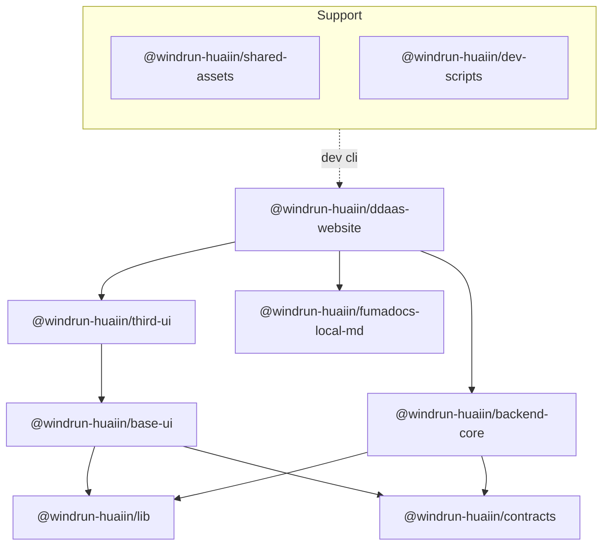

# Windrun Huaiin Monorepo

```mermaid
graph TD
    %% 定义布局方向为从上到下
    direction TB

    %% 左侧：支撑工具层（整体）
    subgraph Support
        direction TB
        S1["@windrun-huaiin/shared-assets"]
        S2["@windrun-huaiin/dev-scripts"]
    end

    %% 右侧：业务包（按层级从上到下排列，保证无交叉）
    A["@windrun-huaiin/ddaas-website"]
    B["@windrun-huaiin/third-ui"]
    D["@windrun-huaiin/fumadocs-local-md"]
    C["@windrun-huaiin/backend-core"]
    E["@windrun-huaiin/base-ui"]
    F["@windrun-huaiin/lib"]
    G["@windrun-huaiin/contracts"]

    %% 业务依赖关系（严格从上到下，不交叉）
    A --> B
    A --> C
    A --> D

    B --> E
    E --> F
    E --> G

    C --> F
    C --> G

    %% 支撑层 → 业务包整体，箭头标注 dev cli（只标一次，对齐你给的图）
    Support -.->|dev cli| A
```