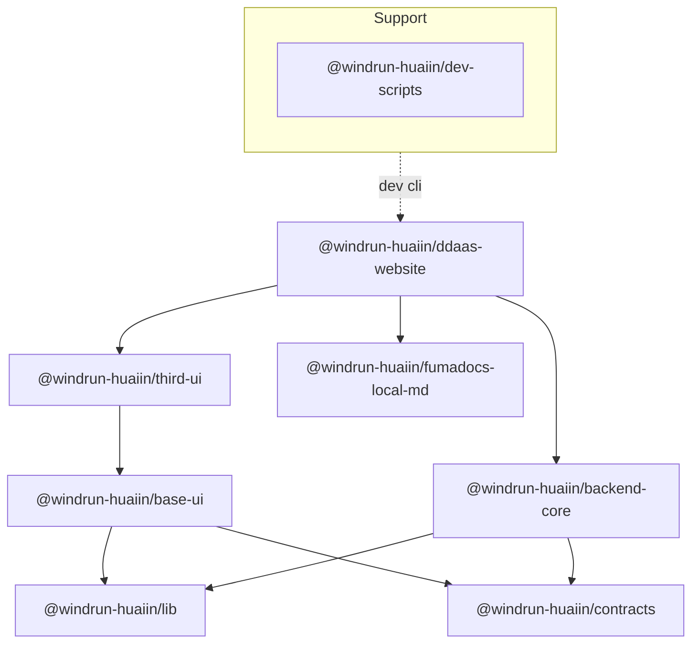

# Windrun Huaiin Monorepo

- `@windrun-huaiin/contracts`: Core types and rule
- `@windrun-huaiin/lib`: Common util
- `@windrun-huaiin/base-ui`: Base UI-components, without framework
- `@windrun-huaiin/third-ui`: Integrate Thirty Part frameworks, components for webpages
- `@windrun-huaiin/backend-core`: Base and common DB handlers, such as prisma, upstash, stripe, webhooks
- `@windrun-huaiin/fumadocs-local-md`: MDX docs as pages, a moudle for mdx files build
- `@windrun-huaiin/ddaas-website`: Main website as example
- `@windrun-huaiin/dev-scripts`: CLI util for dev or build scripts

