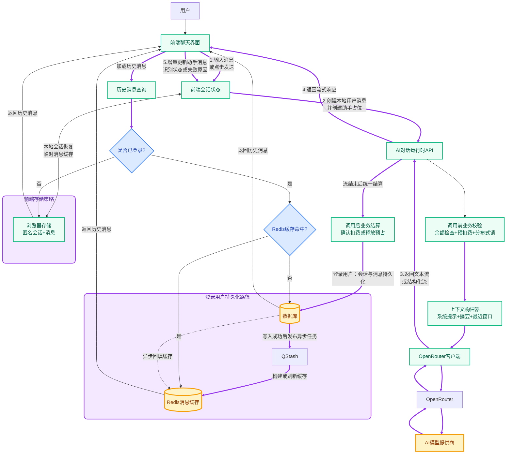
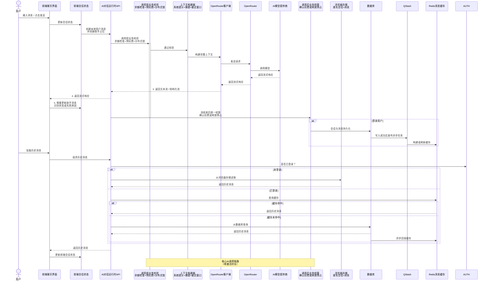

# AI 架构设计

本文档描述一套面向后续项目复用的 AI Conversation Runtime 架构。它不是某个页面的接口说明，也不是某个业务场景的 prompt 设计，而是一个以 OpenRouter 为基础 AI 服务的通用对话运行时设计。

## 用户视角交互架构

下面这张图描述用户视角下的主数据流：前端如何触发消息生成、运行时如何构建上下文并调用 OpenRouter、调用前如何做余额校验/预扣费/分布式锁、调用后如何结算，以及匿名与登录用户分别如何存储，并在登录态下通过 DB、QStash、Redis 形成异步持久化链路。



这张图表达的是运行时主链路，不包含具体 UI 展示样式、消息卡片排版、按钮行为等产品层细节。




## 设计立场

AI 调用能力不应该被理解为“封装一个 OpenRouter API route”。对于 AI 应用，它更接近一个基础运行时：

```text
AI Conversation Runtime
```

它负责：

- 会话边界。
- 消息状态。
- 流式协议。
- 多轮上下文。
- 滑动窗口。
- 摘要记忆。
- 存储策略。
- Mock 场景。
- OpenRouter 调用。
- Prompt / 内容管理。
- 中断、超时、错误分类。

具体业务产品只是在这个 runtime 上配置：

- 业务 prompt。
- 模型选择。
- 可用功能。
- 上下文策略。
- 存储策略。
- UI 形态。

## OpenRouter-first

本架构明确以 OpenRouter 作为基础 AI 服务，不再额外抽象为 provider-agnostic 设计。

原因：

- OpenRouter 本身已经是多模型聚合层。
- 模型选择、供应商路由、provider options 可以通过 OpenRouter 承担。
- 应用层再抽一层 OpenAI / Anthropic / local provider adapter，短期收益不高，反而会使设计发散。

推荐分层：

```text
Application
  -> AI Conversation Runtime
    -> OpenRouter Client
      -> Models / Providers routed by OpenRouter
```

应用层需要关心的是：

- `modelName`
- OpenRouter API key
- OpenRouter headers
- OpenRouter provider options
- `session_id`
- stream behavior
- timeout
- error type

不建议在当前架构里再引入通用 model provider router。

## 核心模块

推荐的核心模块如下：

```text
AI Conversation Runtime
  - Session Layer
  - Message State Layer
  - Stream Protocol Layer
  - Context Builder Layer
  - Memory Layer
  - Storage Strategy Layer
  - Mock Scenario Layer
  - Prompt / Content Layer
  - OpenRouter Client Layer
```

这些模块的目标不是一次性实现所有复杂能力，而是先把边界设计正确。具体项目可以按需要裁剪启用，但不应把模块职责混在一个 route 或一个组件里。

## Session Layer

所有 AI 应用都应该有 session 概念，即使不长期落库，也应该有运行期 session。

推荐抽象：

```ts
type ConversationSession = {
  id: string;
  userId?: string;
  mode?: string;
  createdAt: number;
  updatedAt: number;
  messages: ConversationMessage[];
  memory?: ConversationMemory;
  metadata?: Record<string, unknown>;
};
```

session 的作用：

- 定义多轮对话边界。
- 绑定 recent window。
- 绑定 summary memory。
- 绑定用户主动停止和当前生成状态。
- 支持用户回到同一个对话继续上下文。

## Message State Layer

消息设计需要先区分两个层次：

- 前端消息状态。
- 模型输入消息。

对后续可复用的 AI Conversation Runtime，前端展示消息本身就应该支持多模态。纯文本不是另一套模型，而只是多模态消息的一个特例。

推荐做法是：

- 用 `parts` 表达真正展示给用户的消息内容。
- 文本、图片、文件链接等都作为明确的 part 类型存在。
- 运行状态、失败原因、上游状态码放到独立字段。
- 失败场景优先展示 OpenRouter/模型返回的原始可读错误文本。
- 不把停止、超时、失败等状态文案拼进消息正文 part。

推荐抽象：

```ts
type ConversationMessage = {
  id: string;
  role: "user" | "assistant" | "system" | "tool";
  parts: MessagePart[];
  status?: MessageStatus;
  failureReason?: MessageFailureReason;
  errorMessage?: string;
  upstreamStatusCode?: number;
  createdAt: number;
  metadata?: Record<string, unknown>;
};

type MessagePart =
  | { type: "text"; text: string }
  | {
      type: "image";
      url: string;
      mimeType?: string;
      alt?: string;
      source: "internal" | "external";
    }
  | {
      type: "file";
      url: string;
      name?: string;
      mimeType?: string;
      source: "internal" | "external";
    };

type MessageStatus =
  | "streaming"
  | "completed"
  | "stopped"
  | "timeout"
  | "request_aborted"
  | "failed";

type MessageFailureReason =
  | "invalid_request"
  | "auth_error"
  | "insufficient_credits"
  | "model_access_denied"
  | "content_blocked"
  | "rate_limited"
  | "provider_error"
  | "no_provider_available"
  | "empty_response"
  | "stream_error"
  | "unknown";
```

状态设计原则：

- `streaming` 表示正在接收流式文本。
- `completed` 表示正常完成。
- `stopped` 表示用户主动停止。
- `timeout` 表示应用侧显式超时。
- `request_aborted` 表示请求链路在完成前被 abort，不应过度承诺成“用户一定主动断开”。
- `failed` 表示调用失败收尾，具体原因由 `failureReason` 表达。

失败场景下：

- 最终要展示给用户的错误正文，应作为 `text` part 写入 `parts`。
- `errorMessage` 用于保留原始错误信息。
- `failureReason` 用于驱动状态机、监控和 debug。
- 这些失败消息不应再次作为对话上下文发回模型。

兼容当前纯文本形态的方式很直接：

```ts
const assistantMessage: ConversationMessage = {
  id: "msg_1",
  role: "assistant",
  parts: [{ type: "text", text: "Hello" }],
  status: "streaming",
  createdAt: Date.now(),
};
```

后续如果响应里包含图片或文件链接，只是在同一条消息中追加新的 part：

```ts
const assistantMessage: ConversationMessage = {
  id: "msg_2",
  role: "assistant",
  parts: [
    { type: "text", text: "下面是参考图片和附件：" },
    {
      type: "image",
      url: "https://example.com/diagram.png",
      alt: "架构图",
      source: "external",
    },
    {
      type: "file",
      url: "https://example.com/spec.pdf",
      name: "spec.pdf",
      source: "external",
    },
  ],
  status: "completed",
  createdAt: Date.now(),
};
```

资源链接的通用边界建议如下：

- `internal` 表示站内可控资源，例如对象存储、文件服务、媒体代理或受权限保护的应用内资源。
- `external` 表示第三方平台或站外资源链接。
- 图片、音频、视频、PDF、SVG、Mermaid 源文件等都可以统一落到 `image` 或 `file`。
- 是否内嵌展示、预览、下载或跳转，是前端组件策略，不属于这里的消息模型职责。
- 但消息模型需要明确资源来源，因为站内和站外资源在访问稳定性、权限控制、跨域和可用性上有本质区别。
- 不建议为了统一展示体验而把站外资源先下载回站内再二次分发；这属于独立的媒体代理/缓存策略，不应默认成为消息运行时职责。

因此，架构层不应把前端展示消息锁死为 `content: string`。真正需要保持纯文本兼容的是当前实现方式，而不是最终消息模型。

重要原则：

```text
前端消息 != 模型输入消息
```

前端消息可以包含状态、UI 元信息、metadata；模型输入只应该包含模型需要理解的上下文。

## Stream Protocol Layer

流式协议是该架构的重点。

建议定义两级协议：

```text
Basic Protocol: text stream
Advanced Protocol: structured stream
```

### Basic Protocol: text stream

当前项目使用的是 text stream。

优点：

- 简单。
- 易于接入 OpenRouter + AI SDK。
- 前端直接拼接文本。
- 适合纯文本问答。

限制：

- HTTP 200 开始后不能再改成 408 / 499 / 500。
- 半路中断时，错误类型不一定能准确传给前端。
- tool call、多模态、sources、reasoning 等信息不好表达。
- 状态事件只能依赖额外约定或前端兜底。

### Advanced Protocol: structured stream

如果该模块要演进成通用多模态终端能力，推荐目标形态是结构化流。

示例事件：

```ts
type AIStreamEvent =
  | { type: "message_start"; messageId: string }
  | { type: "text_delta"; messageId: string; text: string }
  | {
      type: "image";
      messageId: string;
      url: string;
      mimeType?: string;
      alt?: string;
      source: "internal" | "external";
    }
  | {
      type: "file";
      messageId: string;
      url: string;
      name?: string;
      mimeType?: string;
      source: "internal" | "external";
    }
  | { type: "message_status"; messageId: string; status: MessageStatus }
  | { type: "error"; messageId: string; errorType: string; message?: string }
  | { type: "message_end"; messageId: string };
```

未来可扩展：

```ts
type ExtendedAIStreamEvent =
  | AIStreamEvent
  | { type: "tool_call"; toolCallId: string; name: string; input: unknown }
  | { type: "tool_result"; toolCallId: string; result: unknown }
  | { type: "source"; source: unknown }
  | { type: "audio_delta"; data: unknown };
```

结构化流的价值：

- 半路失败时可以显式发送状态事件。
- tool call 和 tool result 有清晰事件模型。
- 多模态输出更容易扩展。
- 前端状态机更可控。
- 对“模型输出”和“运行时事件”的区分更清楚。

## Response Status Semantics

响应状态需要分成三层理解：

- HTTP status
- 消息级状态 `status`
- 失败分类 `failureReason`

推荐原则：

- 如果在开始输出 stream 之前已经确认失败，应优先返回真实 HTTP status 和结构化错误信息。
- 如果 HTTP 200 的 stream 已经开始输出，就不应再试图修改 HTTP status，而应通过消息状态或结构化 stream error 事件表达失败。
- `upstreamStatusCode` 用于保留上游真实状态码，便于调试、监控和问题归因。
- `failureReason` 负责做跨模型、跨 provider、跨部署环境的稳定业务分类。

推荐对照表：

| HTTP 状态码 | OpenRouter/上游语义 | 运行时消息状态 | failureReason | 备注 |
| --- | --- | --- | --- | --- |
| `400` | 请求参数错误、请求体不合法、上下文不支持等 | `failed` | `invalid_request` | 通常是应用或调用参数问题 |
| `401` | API key 无效、认证失败、key 被禁用 | `failed` | `auth_error` | 属于配置或运维问题 |
| `402` | 额度不足 | `failed` | `insufficient_credits` | 需要单独监控 |
| `403` | 模型不可用、地域限制、权限限制、审核拒绝 | `failed` | `model_access_denied` 或 `content_blocked` | 应优先依据上游错误 message 判断 |
| `408` | 请求超时 | `timeout` | 无 | 这里表示应用层显式 timeout |
| `429` | 频率限制 | `failed` | `rate_limited` | 适合做退避或重试策略 |
| `499` | request aborted | `request_aborted` | 无 | 非 OpenRouter 标准码，用于表达请求链路提前结束 |
| `502` | provider 故障、无效响应、网关错误 | `failed` | `provider_error` | 不应和空响应混淆 |
| `503` | 当前 routing requirements 下无可用 provider | `failed` | `no_provider_available` | 常见于 provider routing 或模型暂不可用 |

补充说明：

- `403` 需要单独对待，不能泛化成普通 stream interruption。
- `403` 或类似拒绝场景下，最终展示文案应优先使用 OpenRouter/模型返回的原始可读错误文本。
- 如果上游通过流式 `error` event 暴露错误，而不是直接返回非 2xx 响应，运行时也应尽量还原真实状态码和错误 message。
- `empty_response` 只应作为兜底分类，而不应吞掉已有的真实上游错误。

通用错误处理原则：

- `timeout`
  应用自己控制的超时，属于独立状态，而不是 `failed(timeout)`。
- `request_aborted`
  表示请求链路提前结束，但不应过度承诺为“用户客户端主动断开”。
- `stream_error`
  表示流已开始或已进入流阶段后异常结束，它适合作为工程分类，不适合作为精确根因。
- `unknown`
  只在无法归类时兜底使用，避免过早扩大其覆盖范围。

无论是同步失败还是流式中途失败，都应遵守一个原则：

```text
优先保留真实上游错误文本，稳定映射业务 failureReason
```

## Business Extension Lifecycle

对实际业务而言，AI 调用不仅是“拿到模型回复”，还经常伴随：

- 调用前校验权限或余额。
- 调用前预占积分或加分布式锁。
- 调用结束后确认扣费或释放预占。
- 调用结束后把消息落库。
- 落库后再触发异步缓存或后处理任务。

这些都属于真实业务场景，但不应直接写死在 AI runtime 主链路里。更合适的做法是：

- AI router 负责统一产出本次 AI 调用的最终业务语义。
- 业务系统通过约定好的 API router 完成预占、结算、持久化等逻辑。
- 默认实现可以是空逻辑或仅打日志，业务按需替换。

### 扩展时机

推荐固定三段扩展时机：

1. `before_ai_call`
2. `settle_ai_call`
3. `persist_ai_messages`

推荐链路：

```text
frontend request
-> edge ai router
-> before_ai_call
-> openrouter
-> runtime 得到最终状态
-> settle_ai_call
-> persist_ai_messages
```

### 1. before_ai_call

用途：

- 校验登录态、权限、套餐或积分余额。
- 预占积分。
- 设置 Redis 分布式锁。
- 做幂等检查。
- 做业务风控或频率限制。

这一阶段如果失败，应直接终止 AI 调用，不进入 OpenRouter。

即使某些业务不需要预占或加锁，这个扩展点也建议保留。默认实现可以直接放行。

### 2. settle_ai_call

这一阶段发生在 AI router 已经知道最终结果之后。

推荐语义：

- `completed` -> 确认扣费
- `stopped` -> 确认扣费
- `timeout` -> 释放预占
- `request_aborted` -> 释放预占
- `failed` -> 释放预占

这里的关键点是：

- 是否计费，应由后端 AI router 判定，而不是前端。
- 用户手动终止是否计费，也应由 router 基于最终状态统一判定。
- 业务计费系统不需要自己理解流式协议细节，只需要接收 runtime 给出的最终语义。

### 3. persist_ai_messages

消息落库不应与计费结算混在一个扩展点里。更稳妥的做法是：

- 先完成本次调用的计费结算。
- 再把 user message / assistant message / 最终状态交给持久化 API。
- 持久化 API 内部再决定是否写 DB、是否发 QStash、是否更新 Redis。

典型用途：

- 登录用户消息写入数据库。
- 写库成功后发布 QStash 任务。
- QStash 异步消费后构建或刷新 Redis 缓存。
- 为后续摘要、分析、审计保留消息记录。

这一步是业务可选能力，不应成为匿名会话或纯浏览器模式的强依赖。

### Edge 运行时约束

后端 AI router 必须兼容 Edge Runtime，因此业务扩展方式应优先采用 HTTP API 调用，而不是直接耦合 Node-only 依赖。

推荐方式：

- Edge router 通过 `fetch` 调业务自己的 API router。
- 业务自己的 API 再决定是否访问 DB、Redis、QStash 或其他后端服务。
- 如果业务使用的是 edge-compatible 服务，也可以直接从 Edge router 发起 HTTP 调用。

不建议在 AI runtime 主链路中直接绑定某个具体数据库 SDK、Redis SDK 或消息队列 SDK。

### 设计边界

这一节的目标不是规定业务如何建模账单、积分、订单或消息表，而是明确：

- AI runtime 需要提供调用前与调用后的业务扩展时机。
- 计费判定语义应由后端 AI router 统一给出。
- 消息落库是独立于计费的后置能力。
- 这些扩展点应通过固定 API 约定接入，而不是把整个执行流程开放成任意 hook 系统。

## Context Builder Layer

Context Builder 是多轮对话的核心。业务代码不应该随意拼接 messages，而应通过统一上下文构建器。

输入：

```ts
type ContextBuildInput = {
  systemPrompt: string;
  messages: ConversationMessage[];
  memory?: ConversationMemory;
  maxRecentTurns: number;
  tokenBudget?: number;
};
```

输出：

```ts
type ModelMessage = {
  role: "system" | "user" | "assistant" | "tool";
  content: unknown;
};
```

Context Builder 负责：

- 过滤隐藏 UI 指令。
- 过滤状态文案。
- 过滤不应进入模型上下文的 metadata。
- 构建滑动窗口。
- 注入 summary memory。
- 控制 token budget。
- 处理多模态消息。
- 拼接 system / developer / tool instructions。

## Memory Layer

推荐采用：

```text
recent window + summary memory
```

滑动窗口负责短期上下文和最近语气；summary memory 负责长期上下文压缩。

推荐抽象：

```ts
type ConversationMemory = {
  summary?: string;
  facts?: string[];
  preferences?: string[];
  decisions?: string[];
  unresolvedQuestions?: string[];
  updatedAt: number;
};
```

### 摘要由谁生成

默认由 AI 生成。它应该是独立的 summarizer 调用，而不是混在主回复调用里。

```text
Main Model: 回答用户
Summary Model: 压缩会话记忆
```

Summary Model 可以更便宜、更快，但 prompt 必须严格，避免记忆漂移。

### 摘要触发时机

触发时机不应绑定数据库，而应绑定上下文状态。

推荐触发条件：

- 超过 `N` 个 user turns。
- 估算 token 超过阈值。
- session idle 后后台压缩。
- 主请求前发现上下文超出 token budget。
- 每次 assistant 完成后异步判断是否需要压缩。

推荐策略：

```text
正常情况：主回复完成后异步摘要
超预算情况：主请求前同步压缩或强裁剪
```

### 摘要参与上下文

后续模型输入推荐结构：

```text
system prompt
+ conversation summary
+ recent message window
```

## Storage Strategy Layer

存储策略只定义三类：

```ts
type ConversationStorageMode =
  | "browser"
  | "redis"
  | "database";
```

### Browser Storage

适合：

- 轻量会话。
- 用户本地恢复。
- 不希望后端保存原始对话。
- 无登录或弱登录场景。

特点：

- 实现简单。
- 不跨设备。
- 用户清缓存会丢。
- 不适合后端异步摘要任务。

### Redis Storage

适合：

- 短期 session memory。
- 流式状态临时缓存。
- 跨请求上下文。
- 摘要任务队列或短期缓存。

特点：

- 适合作为运行时记忆层。
- 可以设置 TTL。
- 不适合长期历史。
- 对异步 summary 比 browser storage 更友好。

### Backend DB Storage

适合：

- 长期会话历史。
- 跨设备恢复。
- 用户历史记录。
- 数据分析或质量评估。
- 审计或合规需求。

特点：

- 能力最完整。
- 成本和治理要求最高。
- 适合真正 chat 产品或对话历史有业务价值的产品。

## 对话数据的价值

对话数据是 AI 上层应用的核心资产，但不一定必须以原文长期保存。

它的价值包括：

- 理解用户真实任务。
- 发现模型失败模式。
- 优化 prompt。
- 评估模型选择。
- 改进产品路径。
- 构建 eval 样本。
- 做安全与合规审计。
- 做个性化记忆。

同时它也有风险：

- 隐私。
- 敏感信息。
- 合规。
- 存储成本。
- 用户信任。
- 删除和导出要求。

推荐分层处理：

```text
Raw Conversation: 原始对话，短期或按用户授权保留
Summary Memory: 长期上下文，压缩和去敏
Analytics Events: 产品分析，尽量结构化和脱敏
Eval Samples: 人工筛选或脱敏后进入评测集
```

## Mock Scenario Layer

Mock 是开发/测试行为，应该与正常请求主逻辑剥离。

推荐原则：

- route 中先通过 `OPENROUTER_ENABLE_MOCK` 判断是否允许 mock。
- 只有开关为真时，才进入独立 mock helper。
- mock helper 内部通过 `OPENROUTER_MOCK_TYPE` 数字场景切换。

mock 的目标是验证前端状态机，而不是 100% 复刻真实网络语义。

建议场景：

```text
0: 正常 mock 流式成功
1: 首包前延迟后正常成功
2: 立即 timeout
3: 输出部分内容后 timeout
4: 输出部分内容后 request_aborted
5: 输出部分内容后 failed(stream_error)
```

纯 text stream 在 HTTP 200 发出后不能再修改 HTTP status，因此 3 / 4 / 5 这类场景如果要在 mock 中稳定区分，通常需要额外约定信号。这是测试手段，不代表线上一定能同样精确分类。

## Prompt / Content Layer

主功能文案应从 route/control-flow 代码中抽离：

- System prompts。
- Practice start prompts。
- Mock model responses。
- 用户可见状态文案。
- 驱动 UI 行为的 API error reason constants。

不要过度抽象日志文案或临时 debug label。日志属于辅助功能，不是 AI 请求/响应的主功能路径。

## 部署与日志边界

本架构不单独设计观测平台。

当前项目部署在 Vercel，后续也可能部署到 Cloudflare、Google Cloud、AWS 等平台。这些平台本身提供日志、错误、指标或 trace 能力。

AI Conversation Runtime 的职责是：

- 输出清晰的错误类型。
- 保留必要日志。
- 让请求、session、状态变化可被平台日志捕获。

不建议在该模块内建设独立 observability 系统。

## 当前落地建议

当前项目已经具备：

- OpenRouter text stream。
- 前端流式消费。
- 消息状态机。
- 用户主动停止。
- timeout / request_aborted / failed 分类。
- mock 场景。
- 滑动窗口上下文。
- 主功能文案抽离。

下一步更适合推进：

1. 抽 Context Builder。
2. 引入 Summary Memory。
3. 明确 Storage Strategy。
4. 评估是否需要从 text stream 升级为 structured stream。

推进方式不是“先乱做，后重构”，而是：

```text
按最终架构分层，逐步替换内部实现
```
